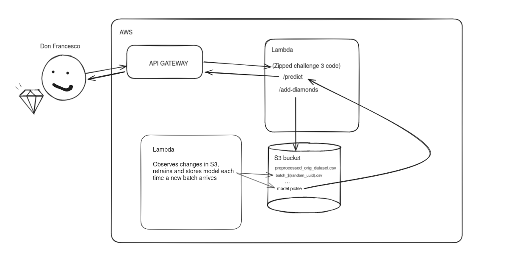

# Challenge 4

First thing I'd do is [zip](https://docs.aws.amazon.com/lambda/latest/dg/python-package.html) the Challenge 3 application with its dependencies and deploy it that way in Lambda AWS. Then I'd setup the API gateway to indicate that the deployed Lambda is a REST API with its endpoints. The main problem is the dataset. In the last challenges we had the dataset stored in a csv and we were locking and writing it each time we added a batch of diamonds. This worked in a single process backend, but it won't work in a serverless environment. I believe there are two main options: having an actual relational database and update it constantly which would be a bit more complex or, alternatively, have the original csv dataset preprocessed and stored in a S3 bucket. Each time a new batch of diamond arrives we just store it as a new blob csv with, for instance, the name `batch_$(random_uuid)`. Changes in the S3 bucket launches a Lambda function that retrains the model by pulling all these csvs, merging them together in-memory and then retraining the model with all the data. The model can then be pickled with Python, stored in S3 and loaded each time it is needed for a prediction. If deemed necessary and if Don Francesco doesn't need the consistency of always using the latest model, the model can be cached to reduce IO and network processing and be fetched once in a while or by checking if the checksum of the cached model and the one stored in S3 differs.

There are more interesting solutions to the problem using Amazon SageMaker, but I found it a bit overkill for such a small model. If the database grows too much or if we start using a bigger model we may use a solution involving SageMaker instead.

Alternatively, here's an official blogpost from Amazon explaining [how to deploy a serverless ML inference endpoint using FastAPI, AWS Lambda, and AWS CDK](https://aws.amazon.com/blogs/machine-learning/deploy-a-serverless-ml-inference-endpoint-of-large-language-models-using-fastapi-aws-lambda-and-aws-cdk/), which can give some insights on how to structure and deploy the project.

Here's a diagram of Don Francesco enjoying his diamonds!

